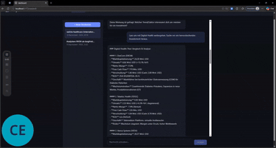
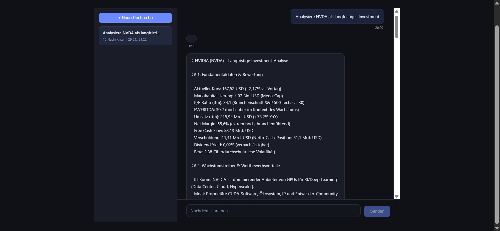
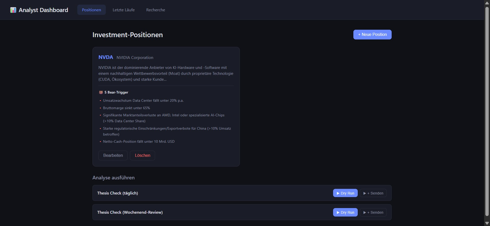
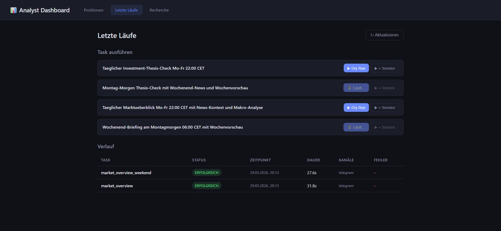

# Financial Analyst Engine

AI-powered investment research, portfolio monitoring and market analysis with automated Telegram delivery.



## How It Works

The system covers the full lifecycle of an investment — from initial research to ongoing monitoring:

### 1. Research — Identify Investment Opportunities via Chatbot

The integrated research chatbot (React frontend + Claude-based agent) enables interactive stock analysis directly in the dashboard. The agent pulls from multiple external data sources:

- **Real-time quotes** via yfinance (stocks, indices, sectors)
- **Fundamentals** (revenue, earnings, margins, valuation metrics)
- **Macro indicators** (VIX, Treasury yields, US Dollar Index) via yfinance and FRED API
- **Financial news** via RSS feeds and news scraping

Through multi-turn conversation you can test hypotheses, compare stocks, and develop a well-founded investment thesis with concrete bear-case triggers.



### 2. Turn a Thesis into a Position — One Click from Chat to Dashboard

Once the research agent has gathered enough data, it proposes a structured investment position via the `propose_position` tool (ticker, thesis, bear triggers). The proposal appears as a card in the chat — clicking "Create Position" promotes the thesis to an active position in the dashboard and enrolls it in daily monitoring.



### 3. Daily Thesis Monitoring — Telegram Alerts for Broken Theses

Every evening (Mon-Fri 22:00, plus Monday 06:00) the system automatically checks each active position against its defined bear triggers. Current prices, fundamentals, and news are evaluated. If issues are detected you receive a structured Telegram message with risk assessment and recommended action. The system remembers previous checks — once flagged, warnings cannot silently disappear.

### 4. Daily Market Newsletter — Big Picture via Telegram

In parallel, the market overview task delivers a daily briefing on the overall market: S&P 500, DAX, Nikkei, Gold, Oil, EUR/USD, VIX, Treasury yields, sector performance, and current financial news. GPT produces a structured market assessment with sentiment ratings and risk indicators — also delivered automatically via Telegram.



## Tech Stack

| Area | Technologies |
|------|-------------|
| Backend | Python 3.11+, FastAPI, APScheduler, Pydantic |
| AI | OpenAI GPT-5.5 via Responses API (native Structured Output) |
| Data Sources | yfinance (quotes, fundamentals, macro), RSS/News Scraping, FRED API (macro indicators) |
| Frontend | React 19, TypeScript, Vite |
| Storage | SQLite (runs & cache), YAML (task configuration & positions) |
| Output | Telegram Bot API |

## Project Structure

```
financial-analyst/
├── engine/                        # Python backend
│   └── src/analyst/
│       ├── analysis/              # Analyzers (Market Overview, Thesis Check)
│       ├── api/                   # FastAPI REST endpoints
│       ├── core/                  # Config, types, cache (SQLite)
│       ├── data/                  # Data sources (yfinance, news, FRED)
│       ├── llm/                   # OpenAI client & prompt rendering
│       ├── output/                # Telegram delivery
│       ├── executor.py            # Task execution logic
│       ├── scheduler.py           # Cron scheduler with catch-up
│       └── cli.py                 # CLI (run, list, serve, scheduler)
├── dashboard/                     # React frontend (Vite)
│   └── src/
│       ├── pages/                 # Positions, Runs, Run Detail
│       ├── components/            # Cards, forms, trigger buttons
│       └── api/                   # Typed API client
├── config/
│   ├── tasks/                     # Task definitions (YAML)
│   └── prompts/                   # Jinja2 prompt templates
└── data/                          # SQLite DB, logs, results
```

## Setup

### Prerequisites

- Python 3.11+
- Node.js 18+
- OpenAI API Key
- Telegram Bot Token + Chat ID

### Installation

```bash
# 1. Configure environment variables
cp .env.example .env
# Fill in the following keys:
#   OPENAI_API_KEY, TELEGRAM_BOT_TOKEN_BRIEFING,
#   TELEGRAM_BOT_TOKEN_THESIS, TELEGRAM_CHAT_ID

# 2. Create task configurations from example templates
cp config/tasks/investment_thesis_check.yaml.example config/tasks/investment_thesis_check.yaml
cp config/tasks/investment_thesis_check_weekend.yaml.example config/tasks/investment_thesis_check_weekend.yaml
# Positions can be managed later via the dashboard or research chat.
# The example positions in the YAML files can be removed or adjusted.

# 3. Install backend
cd engine
pip install -e .

# 4. Install frontend
cd ../dashboard
npm install
```

> **Important:** Without the duplicated YAML files (step 2), no investment positions can be saved — neither via the dashboard nor the research chat.

## Usage

### CLI

```bash
analyst list                              # Show all tasks
analyst run market_overview --dry-run     # Run analysis (skip Telegram)
analyst run investment_thesis_check       # Thesis check with delivery
analyst scheduler start                   # Start cron scheduler
analyst scheduler status                  # Show next runs & last status
```

### Dashboard

```bash
# Terminal 1: API server
analyst serve                             # http://localhost:8000

# Terminal 2: React dev server
cd dashboard && npm run dev               # http://localhost:5173
```

The dashboard provides:
- **Positions** — Manage stocks with investment thesis and bear triggers
- **Runs** — Trigger analyses manually (dry run or with Telegram delivery)
- **History** — Browse past runs with full result details

## Task Configuration

Tasks are defined as YAML in `config/tasks/`. See `*.yaml.example` for templates:

```yaml
schedule:
  cron: "0 22 * * 1-5"           # Mon-Fri at 22:00
  timezone: "Europe/Berlin"

parameters:
  positions:                      # Thesis check only
    - ticker: "NVDA"
      name: "NVIDIA"
      thesis: "AI infrastructure monopolist..."
      bear_triggers:
        - "AI investment slowdown"
        - "Export restrictions"

llm:
  model: "gpt-5.5"
  prompt_template: "thesis_check"
  reasoning_effort: "medium"

output_channels:
  - type: telegram
    config:
      bot_token_env: "TELEGRAM_BOT_TOKEN_THESIS"
      chat_id_env: "TELEGRAM_CHAT_ID"
```
